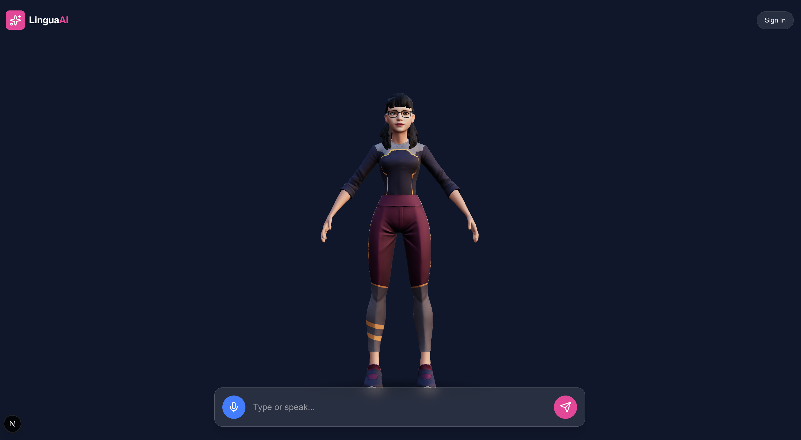

# AI Avatar for Learning 🎓

An interactive 3D AI avatar learning assistant powered by OpenAI's GPT-4 and Text-to-Speech, featuring real-time conversation streaming and synchronized lip movements.

<div align="center">
  
  <p><em>Interactive voice-to-voice conversation with a 3D AI avatar</em></p>
</div>

## ✨ Features

- **🎤 Speech-to-Speech Conversation**: Talk naturally with the avatar using voice input and hear real-time responses
- **🎭 3D Interactive Avatar**: Rendered using Three.js and React Three Fiber with a Ready Player Me character model
- **⚡ Real-time Streaming**: GPT-4 responses stream in real-time with sentence-by-sentence text-to-speech generation
- **👄 Lip Sync Animation**: Audio-reactive lip sync using Web Audio API frequency analysis
- **🗣️ Natural Speech**: OpenAI Whisper (STT) and TTS integration for realistic voice interaction
- **💬 Dual Input Modes**: Type or speak - both work seamlessly
- **🎨 Modern UI**: Beautiful, responsive chat interface built with Tailwind CSS
- **🔊 Seamless Audio Queue**: Multiple audio chunks play sequentially without gaps

## 🛠️ Tech Stack

- **Framework**: [Next.js 16](https://nextjs.org/) (App Router)
- **Language**: TypeScript
- **3D Rendering**: [Three.js](https://threejs.org/), [@react-three/fiber](https://docs.pmnd.rs/react-three-fiber), [@react-three/drei](https://github.com/pmndrs/drei)
- **AI**: [OpenAI API](https://platform.openai.com/) (GPT-4o, Whisper, TTS-1)
- **Audio**: Web Audio API, MediaRecorder API
- **Styling**: [Tailwind CSS](https://tailwindcss.com/)
- **Icons**: [Lucide React](https://lucide.dev/)

## 📋 Prerequisites

- Node.js 18+ 
- npm, yarn, pnpm, or bun
- OpenAI API Key

## 🚀 Getting Started

### 1. Clone the repository

```bash
git clone <repository-url>
cd ai-avatar-for-learning
```

### 2. Install dependencies

```bash
npm install
# or
yarn install
# or
pnpm install
```

### 3. Set up environment variables

Create a `.env.local` file in the root directory:

```bash
cp env.example .env.local
```

Edit `.env.local` and add your OpenAI API key:

```env
OPENAI_API_KEY=sk-your-api-key-here
```

### 4. Run the development server

```bash
npm run dev
# or
yarn dev
# or
pnpm dev
# or
bun dev
```

### 5. Open the application

Navigate to [http://localhost:3000](http://localhost:3000) in your browser.

## 🎮 Usage

### Voice Conversation (Recommended)

1. Click the **🎤 blue microphone button**
2. Grant microphone permission when prompted
3. Speak your message clearly
4. Click the button again to stop recording
5. Watch as your speech is transcribed and the avatar responds with voice!

### Text Conversation

1. Type your message in the input field
2. Press **Enter** or click the **pink send button**
3. The avatar will respond with voice and text

### Tips for Best Experience

- 🎧 Use headphones to prevent echo
- 🗣️ Speak clearly and at a normal pace
- 📍 Allow microphone access when prompted
- 🔊 Ensure your volume is up to hear the avatar
- 💬 Try both voice and text - they work seamlessly together!

## 📁 Project Structure

```
ai-avatar-for-learning/
├── app/
│   ├── api/
│   │   ├── chat/
│   │   │   └── route.ts          # Streaming GPT-4 chat endpoint
│   │   ├── tts/
│   │   │   └── route.ts          # Text-to-speech endpoint
│   │   └── stt/
│   │       └── route.ts          # Speech-to-text endpoint (Whisper)
│   ├── globals.css               # Global styles
│   ├── layout.tsx                # Root layout
│   └── page.tsx                  # Home page
├── components/
│   ├── Avatar.tsx                # 3D avatar with lip sync
│   ├── Experience.tsx            # Three.js scene wrapper
│   ├── Header.tsx                # App header
│   └── UI.tsx                    # Chat interface with voice input
├── hooks/
│   ├── useChat.ts                # Chat logic with streaming and TTS queue
│   └── useAudioRecording.ts     # Audio recording with MediaRecorder
├── public/
│   └── avatar.png                # App screenshot
└── README.md
```

## 🎯 How It Works

### Voice Input Flow (Speech-to-Speech)

1. **🎤 Voice Recording**: User clicks microphone button and speaks
2. **🔴 Recording**: Button turns red and pulses while recording
3. **✋ Stop Recording**: User clicks again to stop
4. **📝 Transcription**: Audio sent to `/api/stt` using Whisper API
5. **💬 Text Display**: Transcribed text briefly appears in input
6. **🤖 AI Response**: Message sent to GPT-4 via `/api/chat`
7. **📡 Streaming**: Response streams word-by-word to UI
8. **🔊 Text-to-Speech**: Complete sentences converted to audio via `/api/tts`
9. **🎭 Lip Sync**: Avatar's mouth moves naturally with speech

### Text Input Flow (Traditional Chat)

1. **⌨️ Type Message**: User types in the input field
2. **📤 Send**: User presses Enter or clicks send button
3. **🤖 AI Response**: Same as steps 6-9 above

### API Routes

#### `POST /api/chat`
- Accepts: `{ messages: Message[] }`
- Returns: Streaming text response
- Uses: OpenAI GPT-4o with streaming enabled

#### `POST /api/tts`
- Accepts: `{ text: string }`
- Returns: Audio MP3 buffer
- Uses: OpenAI TTS-1 model with "alloy" voice

#### `POST /api/stt`
- Accepts: FormData with audio file
- Returns: `{ text: string }`
- Uses: OpenAI Whisper-1 model for transcription

## 🎨 Customization

### Change Avatar Model

Edit `components/Avatar.tsx`:

```typescript
const { scene } = useGLTF("YOUR_MODEL_URL.glb");
```

### Change AI Voice

Edit `app/api/tts/route.ts`:

```typescript
const mp3 = await openai.audio.speech.create({
    model: "tts-1",
    voice: "alloy", // Options: alloy, echo, fable, onyx, nova, shimmer
    input: text,
});
```

### Change AI Model

Edit `app/api/chat/route.ts`:

```typescript
const stream = await openai.chat.completions.create({
    model: "gpt-4o", // Change to gpt-3.5-turbo, gpt-4-turbo, etc.
    // ...
});
```

### Adjust Lip Sync Sensitivity

Edit `components/Avatar.tsx`:

```typescript
// Lower value = more sensitive
const volume = Math.min(1, average / 30); // Adjust 30 to your preference
```

## 🐛 Debugging

Enable console logging to debug the application:

1. Open browser DevTools (F12)
2. Check Console tab for logs:
   - **Voice Input**: "Requesting microphone access...", "Recording started", "Transcription successful: ..."
   - **TTS**: "Generating speech for: ...", "✅ Audio playing successfully"
   - **Lip Sync**: "Audio routing connected: element -> analyser -> destination"

## 🔧 Common Issues

### Microphone Not Working
- **Permission Denied**: Check browser settings and allow microphone access
- **No Recording**: Ensure you're using HTTPS or localhost (required for MediaRecorder API)
- **Silent Recording**: Check your system microphone settings and select the correct input device
- **Browser Compatibility**: Use Chrome, Edge, or Firefox (Safari may have limitations)

### Voice Transcription Fails
- Verify OpenAI API key is valid and has Whisper API access
- Check that audio blob size is > 0 in console logs
- Ensure you speak for at least 1-2 seconds before stopping
- Check network tab for `/api/stt` request/response

### No Audio Playing (TTS)
- Check that your browser allows autoplay with user interaction
- Verify OpenAI API key is valid
- Check browser console for errors
- Ensure audio element is properly connected to Web Audio API
- Try turning up your device volume

### Lip Sync Not Working
- Verify audio is playing first (check console for "✅ Audio playing successfully")
- Check that Web Audio API connection is established
- Try adjusting sensitivity in `Avatar.tsx` (lower value = more sensitive)

### Streaming Not Working
- Verify API route is returning streaming response
- Check network tab in DevTools for chunked transfer encoding
- Ensure `/api/chat` route has `stream: true` enabled

## 📝 Scripts

- `npm run dev` - Start development server
- `npm run build` - Build for production
- `npm run start` - Start production server
- `npm run lint` - Run ESLint

## 🚢 Deployment

### Deploy on Vercel

The easiest way to deploy is using [Vercel](https://vercel.com):

1. Push your code to GitHub
2. Import the project in Vercel
3. Add environment variables (`OPENAI_API_KEY`)
4. Deploy!

[](https://vercel.com/new/clone?repository-url=https://github.com/your-repo)

## 📄 License

MIT

## 🤝 Contributing

Contributions are welcome! Please feel free to submit a Pull Request.

## 🙏 Acknowledgments

- [Ready Player Me](https://readyplayer.me/) for the 3D avatar model
- [OpenAI](https://openai.com/) for GPT-4 and TTS APIs
- [Pmndrs](https://pmnd.rs/) for React Three Fiber ecosystem
